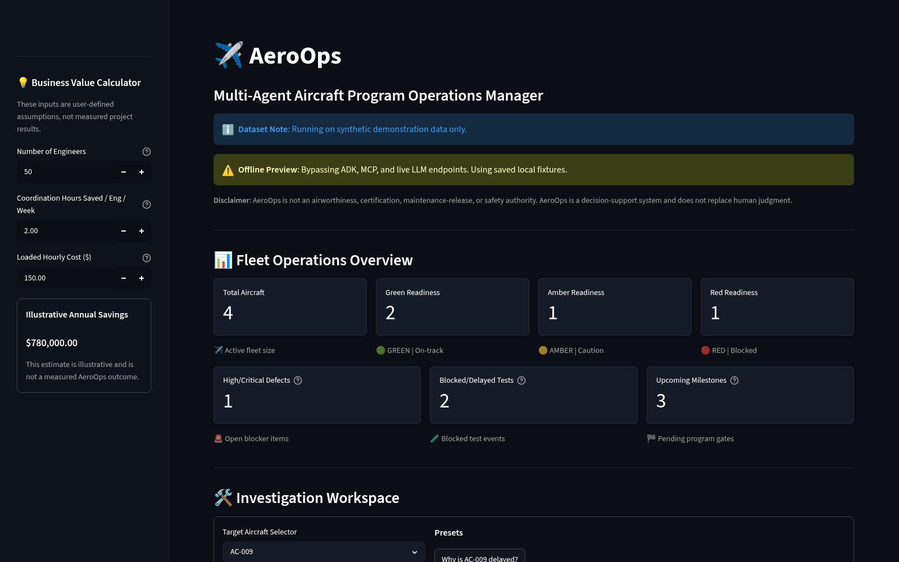
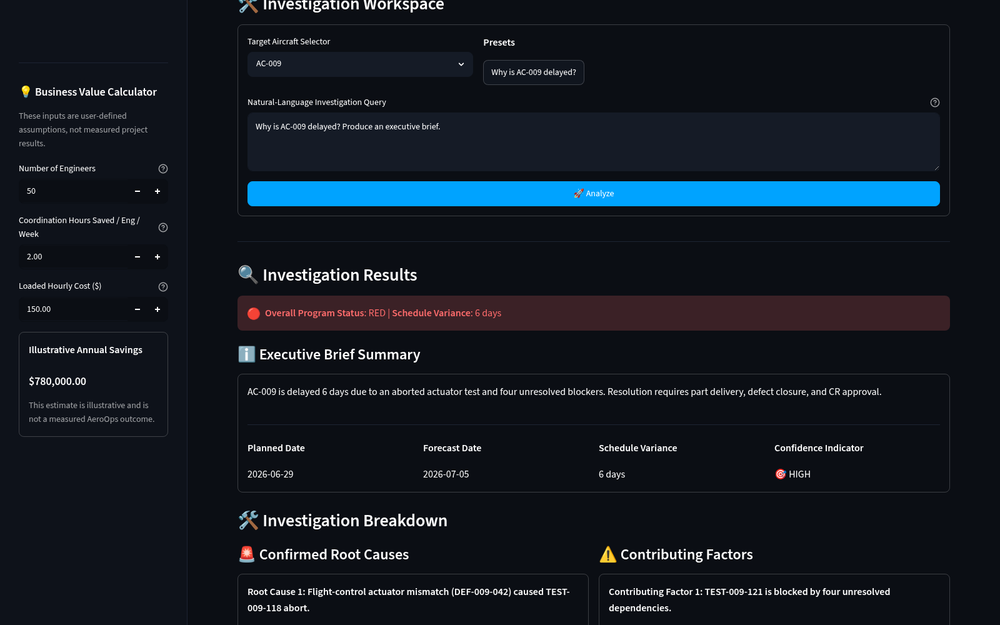
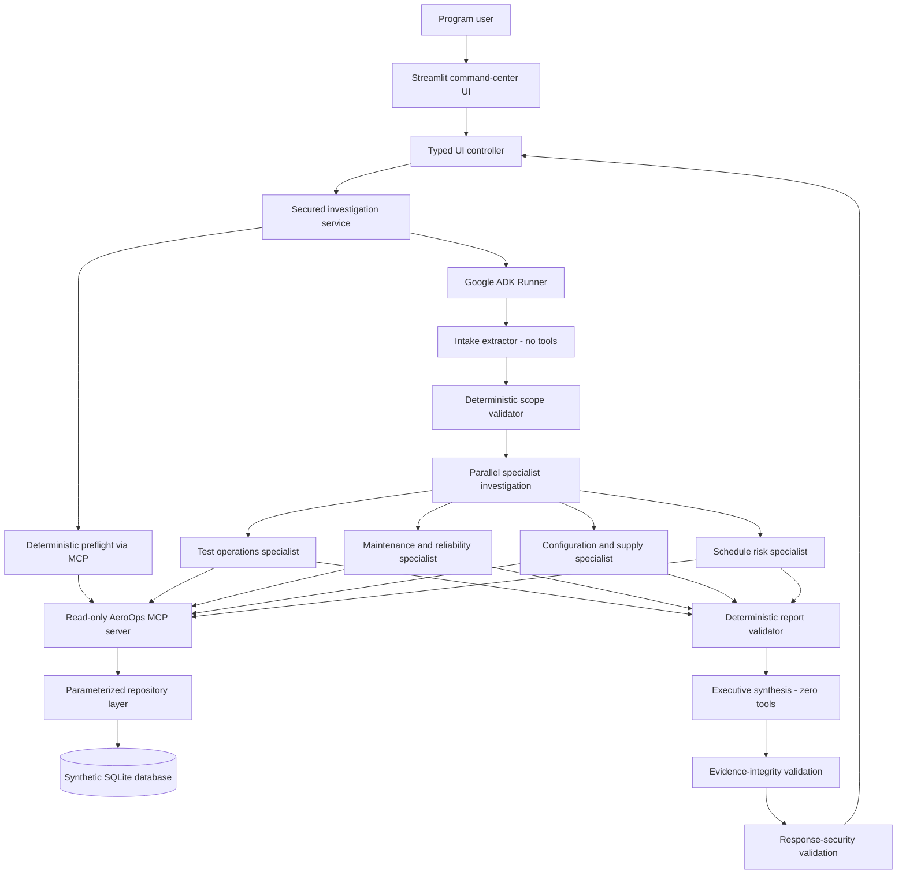
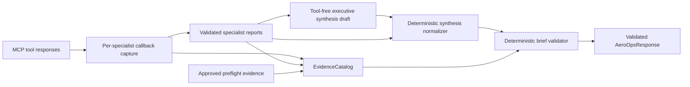

# AeroOps

[](https://github.com/gbkeku/aeroops-ai/actions/workflows/ci.yml)
[](https://aeroops-ai.streamlit.app)

[](LICENSE)

**Evidence-backed, multi-agent aircraft-program operations decision support.** AeroOps combines Google Agent Development Kit (ADK), a custom read-only Model Context Protocol (MCP) server, deterministic evidence validation, security guardrails, and a Streamlit command-center interface to explain program delays and recommend accountable next actions.

## Links

- **Repository:** [github.com/gbkeku/aeroops-ai](https://github.com/gbkeku/aeroops-ai)
- **Public demo:** [aeroops-ai.streamlit.app](https://aeroops-ai.streamlit.app)
- **Browser demo recording:** [AeroOps offline walkthrough](docs/images/aeroops_demo_walkthrough.webm)
- **Evaluation report:** [docs/evaluation.md](docs/evaluation.md)

> **Synthetic-data and decision-support notice:** Every aircraft, defect, test, maintenance task, part, change request, milestone, and dependency in this repository is fictional and dated to the deterministic snapshot **2026-06-24**. AeroOps is not an airworthiness, certification, maintenance-release, or safety authority. It supports human decision-making; it does not replace accountable engineering judgment.



## Business problem

Aircraft-development programs coordinate test events, defects, maintenance work, engineering changes, parts constraints, milestones, and schedule dependencies across multiple systems and teams. When a test is aborted or a milestone slips, program leaders may spend hours correlating records before they can answer basic operational questions:

- What directly caused the delay?
- Which dependencies are blocking the next test?
- Which issues are confirmed facts versus assumptions?
- What actions should each responsible team take next?
- Which source records support the conclusion?

AeroOps turns that fragmented investigation into a structured, traceable executive brief while preserving the source evidence behind every accepted operational claim.

## Why a multi-agent system

The problem crosses distinct engineering domains. A single general-purpose prompt would either receive excessive tool access or mix unrelated reasoning into one opaque response. AeroOps instead assigns narrowly scoped responsibilities to specialist agents that work in parallel:

- Test operations examines aborted or blocked tests and associated defects.
- Maintenance and reliability examines required inspections and incomplete maintenance work.
- Configuration and supply examines parts constraints and change requests.
- Schedule risk examines milestone variance and dependency exposure.

The specialists use least-privilege MCP toolsets, write separate structured reports, and are followed by deterministic report validation. A tool-free synthesis agent then combines only the validated reports. A final evidence-integrity validator independently checks the result before it reaches the UI.

## Primary demonstration: AC-009

> **Why is aircraft AC-009 delayed, what is blocking TEST-009-121, and what should program leadership do next?**

| Item | Verified result |
|---|---|
| Target milestone | `MS-009-FTC` |
| Planned date | `2026-06-29` |
| Forecast date | `2026-07-05` |
| Schedule variance | **6 days** |
| Aborted test | `TEST-009-118` |
| Blocked retest | `TEST-009-121` |
| Defect | `DEF-009-042` |
| Late part | `PART-ACT-774` |
| Pending change | `CR-184` |
| Required inspection | `MNT-009-015` |
| Dependency records | `DEP-009-001` through `DEP-009-004` |

The final accepted evidence set contains exactly those eleven source records. The delay is calculated in Python from the stored milestone dates rather than delegated to a model.



## Architecture



The implementation contains **six LLM agents**, two deterministic validation stages inside the ADK workflow, and post-run evidence and security validation. See [docs/architecture.md](docs/architecture.md).

## Agent descriptions

| Agent or stage | Responsibility | Tool access |
|---|---|---|
| `intake_extractor` | Extracts aircraft scope, user intent, time horizon, and output type | None |
| `scope_validator` | Rejects missing, malformed, ambiguous, or unknown scope | None |
| `test_ops_specialist` | Aircraft status, tests, defects, and dependency blockers | `get_aircraft_status`, `get_test_events`, `get_open_defects`, `get_dependency_graph` |
| `maintenance_specialist` | Defects and maintenance work | `get_open_defects`, `get_maintenance_tasks` |
| `config_supply_specialist` | Parts constraints and engineering changes | `get_parts_constraints`, `get_change_requests` |
| `schedule_risk_specialist` | Aircraft status and schedule dependencies | `get_aircraft_status`, `get_dependency_graph` |
| `report_validator` | Normalizes finding IDs and verifies all specialist reports | None |
| `executive_synthesis` | Produces a compact executive draft; a deterministic callback constructs the typed leadership brief | **None** |

## MCP server and registered tools

`aeroops-data-mcp` is a Python FastMCP server operating over standard input/output. It exposes eleven narrowly scoped, read-only tools and no arbitrary SQL or mutation operation.

| Tool | Purpose |
|---|---|
| `health_check` | Verify MCP and database availability |
| `list_aircraft` | List aircraft, optionally filtered by readiness |
| `get_aircraft_status` | Retrieve one aircraft program-status record |
| `get_milestones` | Retrieve planned and forecast milestones |
| `get_open_defects` | Retrieve open defects, optionally by severity |
| `get_test_events` | Retrieve test events, optionally by status |
| `get_maintenance_tasks` | Retrieve maintenance tasks, optionally by status |
| `get_parts_constraints` | Retrieve material and delivery constraints |
| `get_change_requests` | Retrieve engineering or configuration changes |
| `get_dependency_graph` | Retrieve blocked tests, blockers, edges, and dependency records |
| `get_fleet_summary` | Retrieve aggregate synthetic fleet metrics |

All operational reads use parameterized repository queries. The deployment database is opened read-only, list responses are bounded, and responses contain source references and synthetic-data metadata. See [docs/mcp.md](docs/mcp.md).

## Evidence-integrity architecture



The executive model is not trusted to reproduce the nested evidence schema. An agent-level after-model callback constructs the canonical `ExecutiveBrief` from the already validated specialist reports, using the model only for bounded leadership wording and proposed actions. The validator then checks that every finding has source references, every source was retrieved during the current investigation, records belong to the requested aircraft, relationship claims include the dependency record that proves them, milestone dates match captured evidence, recommendations link to specific findings, and the top-level evidence list equals the accepted evidence union. Unsupported or conflicting evidence prevents the response from being returned.

## Security model

- **Input validation:** query size, control characters, aircraft scope, prompt or secret exfiltration, arbitrary SQL, filesystem access, and mutation requests are checked before Runner construction.
- **Least privilege:** global, per-agent, and preflight tool allowlists restrict the available MCP surface.
- **Strict schemas:** Pydantic models reject invalid or extra tool arguments and malformed responses.
- **Indirect prompt-injection defense:** canonical evidence remains unchanged; only recognized model-bound free text is delimited and marked as untrusted.
- **Resource budgets:** model calls, tool calls, record counts, and payload sizes are bounded per invocation.
- **Safe output:** evidence-integrity and response-security validation run before a result is returned.
- **Audit hygiene:** logs exclude complete queries, prompts, raw MCP bodies, environment mappings, credentials, session state, and hidden reasoning.
- **Read-only persistence:** no mutation tool exists and operational database connections enforce query-only behavior.

See [docs/security.md](docs/security.md) and [docs/threat_model.md](docs/threat_model.md).

## Streamlit live and offline modes

| Mode | Configuration | Behavior |
|---|---|---|
| Offline preview | `AEROOPS_OFFLINE_DEMO=1` | Uses deterministic typed fixtures and does not start Gemini, ADK, MCP, or SQLite. Recommended for the public portfolio demonstration. |
| Live synthetic-data mode | `AEROOPS_OFFLINE_DEMO=0` plus `GOOGLE_API_KEY` | Runs the secured ADK workflow and read-only MCP server against `data/aeroops.db`. |

Live failures never silently fall back to offline fixtures. Both modes show the synthetic-data label and decision-support disclaimer.

## Synthetic data

The committed `data/aeroops.db` contains a deterministic, fictional four-aircraft snapshot dated `2026-06-24`:

- `AC-007` — green
- `AC-008` — amber
- `AC-009` — red
- `AC-010` — green

The database contains no user records, company records, credentials, or proprietary operational data and can be regenerated entirely from source code. See [data/README.md](data/README.md) and [docs/data_dictionary.md](docs/data_dictionary.md).

## Local setup

### Prerequisites

- Python 3.11
- [`uv`](https://docs.astral.sh/uv/)
- Git

### Clone and install

```bash
git clone https://github.com/gbkeku/aeroops-ai.git
cd aeroops-ai
uv sync --locked --all-groups
```

Copy the configuration template:

```bash
cp .env.example .env
```

PowerShell:

```powershell
Copy-Item .env.example .env
```

`uv sync` installs dependencies only; it does not create the SQLite database.

## Database initialization

```bash
uv run aeroops-init-db --reset --db-path data/aeroops.db
uv run python scripts/verify_db_artifact.py
```

The MCP server never creates, resets, seeds, or migrates the database.

## Offline launch

Use these `.env` values:

```dotenv
AEROOPS_OFFLINE_DEMO=1
AEROOPS_MODEL=gemini-2.5-flash
AEROOPS_DB_PATH=data/aeroops.db
GOOGLE_API_KEY=
```

Then launch:

```bash
uv run streamlit run src/aeroops/app.py
```

Offline mode requires neither a database nor an API key.

## Live launch

Initialize the database and use:

```dotenv
AEROOPS_OFFLINE_DEMO=0
AEROOPS_MODEL=gemini-2.5-flash
AEROOPS_DB_PATH=data/aeroops.db
GOOGLE_API_KEY=your-local-key
```

Then run:

```bash
uv run streamlit run src/aeroops/app.py
```

Never commit `.env` or `.streamlit/secrets.toml`.

## Environment variables

| Variable | Required | Default | Purpose |
|---|---:|---|---|
| `AEROOPS_OFFLINE_DEMO` | No | Live mode | Enables offline preview for true values such as `1`, `true`, `yes`, or `on` |
| `AEROOPS_MODEL` | No | `gemini-2.5-flash` | ADK model identifier for live investigations |
| `AEROOPS_MODEL_REQUEST_TIMEOUT_MS` | No | `120000` | Per-request Gemini timeout in milliseconds |
| `AEROOPS_MODEL_RETRY_ATTEMPTS` | No | `4` | Total attempts for transient 408, 429, and 5xx responses |
| `AEROOPS_MODEL_RETRY_INITIAL_DELAY_SECONDS` | No | `1.0` | Initial retry delay |
| `AEROOPS_MODEL_RETRY_MAX_DELAY_SECONDS` | No | `8.0` | Maximum retry delay |
| `AEROOPS_DB_PATH` | Live mode | `data/aeroops.db` | Database path passed to the read-only MCP server |
| `GOOGLE_API_KEY` | Live mode | None | Gemini credential exposed only at the live model boundary |
| `AEROOPS_RUN_E2E_TESTS` | Optional tests | `0` | Enables explicitly requested live-Gemini tests |

## Testing and evaluation commands

```bash
uv run python scripts/secret_scanner.py
uv run python scripts/validate_workflows.py
uv run python scripts/validate_public_docs.py
uv run aeroops-init-db --reset --db-path data/aeroops.db
uv run python scripts/verify_db_artifact.py
uv run ruff format --check src tests scripts
uv run ruff check src tests scripts
uv run pytest tests/test_evaluation_cases.py -v
uv run pytest tests/test_ui_integration.py -v
uv run pytest tests/test_e2e_deterministic.py -v
uv run python scripts/smoke_test_mcp.py
uv run python scripts/smoke_test.py
uv run python scripts/streamlit_process_smoke_test.py
uv run pytest tests/ -v -ra
uv run pytest tests/ -W error::ResourceWarning
```

Latest verified release baseline:

```text
Collected:        248
Passed:           243
Skipped:            5 optional live-Gemini tests
Failed:             0
ResourceWarnings:   0
```

The deterministic evaluation uses the real ADK Runner, actual stdio MCP subprocesses, temporary seeded databases, and model doubles only at the model boundary. See [docs/evaluation.md](docs/evaluation.md).

## GitHub Actions

- **AeroOps CI** runs on pushes to `main`, pull requests targeting `main`, and manual dispatch. It performs workflow validation, secret scanning, deterministic database generation, Ruff checks, evaluation tests, MCP smoke testing, the full suite, the ResourceWarning gate, and a real Streamlit health check.
- **AeroOps Live E2E Verification** is manual-only, protected by the `live-testing` environment, and reads `GOOGLE_API_KEY` from GitHub Secrets.

External actions are pinned to full commit SHAs, checkout credentials are not persisted, and default workflow permissions are read-only. See [docs/github-deployment.md](docs/github-deployment.md) and [docs/github-readiness.md](docs/github-readiness.md).

## Streamlit deployment

The project is prepared for Streamlit Community Cloud:

- Repository: `gbkeku/aeroops-ai`
- Branch: `main`
- Entrypoint: `src/aeroops/app.py`
- Python: 3.11
- Dependencies: `uv.lock`

The public application is deployed at [aeroops-ai.streamlit.app](https://aeroops-ai.streamlit.app). Offline preview is recommended for a deterministic public demonstration; live mode requires a Streamlit secret named `GOOGLE_API_KEY`. See [docs/streamlit-deployment.md](docs/streamlit-deployment.md).

## Project structure

```text
aeroops-ai/
├── .agents/skills/                 # Project systems-engineering skill
├── .github/workflows/              # Credential-free CI and manual live E2E
├── .streamlit/                     # Theme and secrets template
├── data/                            # Synthetic database and regeneration notes
├── docs/                            # Architecture, security, MCP, UI, evaluation
│   └── images/                     # Genuine browser captures and demo recording
├── scripts/                         # Scanners, validators, and smoke tests
├── src/aeroops/
│   ├── db/                          # Schema, deterministic seed, repository
│   ├── agent.py                     # ADK multi-agent workflow
│   ├── mcp_server.py                # Eleven-tool read-only MCP server
│   ├── services.py                  # Secured investigation orchestration
│   ├── validation.py                # Evidence-integrity validation
│   ├── security.py                  # Security policy and response models
│   ├── security_plugin.py           # ADK security hooks
│   ├── ui_controller.py             # Typed UI service boundary
│   └── app.py                       # Streamlit entrypoint
├── tests/                            # Unit, contract, integration, E2E, security
├── AGENTS.md                         # Development and governance rules
├── Makefile
├── pyproject.toml
└── uv.lock
```

## Limitations

- The dataset is synthetic and intentionally small.
- AeroOps is not connected to real aircraft, maintenance, configuration, supplier, email, or ticketing systems.
- The application cannot close defects, approve changes, release configurations, or authorize aircraft operation.
- Live-model wording may vary even when structured validation succeeds.
- The current ADK version emits upstream deprecation notices for workflow APIs used by the course architecture.
- The ROI calculator uses user assumptions and is not a measured project outcome.

## Future work

- Add approved MCP connectors for requirements, configuration, ticketing, and test-management systems.
- Introduce role-based access control and organization-specific authorization.
- Add persistent, privacy-preserving evaluation history and observability.
- Migrate deprecated ADK workflow APIs in a versioned architecture update.
- Extend schedule-risk analysis across multiple aircraft and milestones.
- Add human-approved write workflows with separate credentials, idempotency, rollback, and immutable audit controls.

## Decision-support disclaimer

AeroOps provides evidence-backed program-operations analysis over synthetic data. It does not determine airworthiness, certify compliance, approve maintenance release, authorize configuration changes, or replace qualified engineering, safety, quality, maintenance, or program-management personnel.

## License

This project is licensed under the [MIT License](LICENSE).
