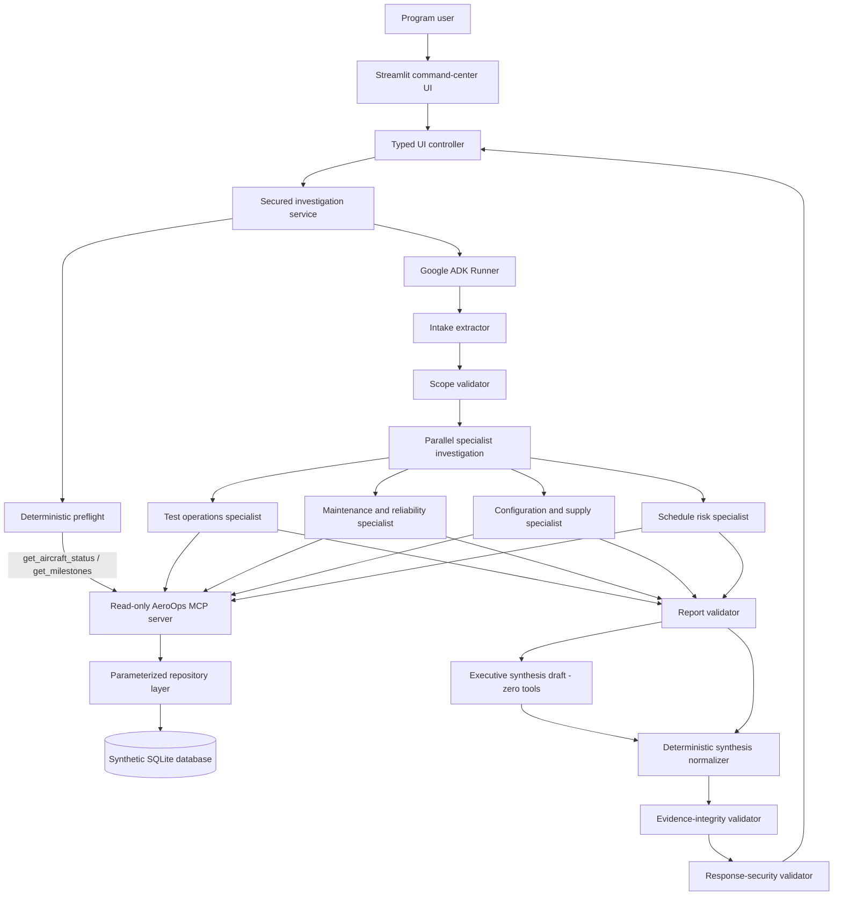
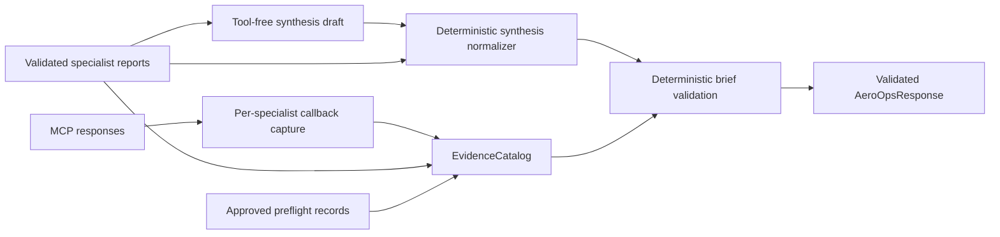

# AeroOps Architecture

AeroOps is a layered, read-only decision-support system. The Streamlit UI never imports SQLite or repository functions; operational reads flow through a typed service boundary and a local MCP server. The multi-agent workflow is implemented with Google ADK and surrounded by deterministic validation stages.

## System overview

## Runtime stages

1. The UI controller validates and packages a typed request.
2. Preflight uses only `get_aircraft_status` and `get_milestones` through MCP.
3. The intake extractor creates a normalized investigation scope and has no tools.
4. The deterministic scope validator rejects missing, malformed, ambiguous, or unknown scope.
5. Four specialists execute in parallel with immutable, least-privilege MCP tool allowlists.
6. The report validator parses all outputs, normalizes findings, verifies evidence, and blocks synthesis if a branch failed.
7. Executive synthesis receives validated reports, has no tools, and emits a compact executive draft. A deterministic after-model callback reconstructs the canonical typed brief from validated specialist state.
8. Evidence-integrity validation checks findings, claims, actions, dates, dependencies, and source IDs against records actually retrieved during the run.
9. Response-security validation rejects authority claims, unsafe recommendations, secret disclosure, hidden-reasoning disclosure, and scope leakage.
10. Streamlit receives only typed presentation models, not raw MCP bodies, prompts, session state, or chain-of-thought.

## Agent team

| Component | Type | Responsibility | MCP tools |
|---|---|---|---|
| `intake_extractor` | LLM agent | Extract request scope and intent | None |
| `scope_validator` | Deterministic ADK stage | Validate request scope | None |
| `test_ops_specialist` | LLM agent | Test events, defects, status, dependencies | `get_aircraft_status`, `get_test_events`, `get_open_defects`, `get_dependency_graph` |
| `maintenance_specialist` | LLM agent | Defects and maintenance | `get_open_defects`, `get_maintenance_tasks` |
| `config_supply_specialist` | LLM agent | Parts and change requests | `get_parts_constraints`, `get_change_requests` |
| `schedule_risk_specialist` | LLM agent | Status and schedule exposure | `get_aircraft_status`, `get_dependency_graph` |
| `report_validator` | Deterministic ADK stage | Validate and normalize specialist reports | None |
| `executive_synthesis` | LLM agent | Produce bounded executive wording and action proposals; deterministic normalization builds the final brief | None |

The workflow contains six LLM agents plus deterministic scope, report, evidence-integrity, and response-security validation.

## Evidence flow

The catalog distinguishes retrieved records, specialist-cited records, approved preflight evidence, and the final admissible evidence union. Conflicting payloads fail validation. A record that exists in the database but was not retrieved and cited during the investigation cannot support the response.

## Trust boundaries

- **Streamlit UI:** no SQLite or repository imports; user-specific state stays in Session State.
- **Service boundary:** validates inputs, owns lifecycle cleanup, and applies evidence and response security.
- **ADK workflow:** parallel specialists use distinct evidence keys; synthesis has no tools or conversation history, and a deterministic after-model normalizer constructs the canonical brief.
- **MCP server:** eleven read-only tools, typed envelopes, record limits, stderr diagnostics, and protocol-only stdout.
- **Repository and SQLite:** parameterized SQL, foreign keys, query-only reads, and deterministic synthetic data.

## Operating modes

- **Offline preview:** `AEROOPS_OFFLINE_DEMO=1`; no Gemini, ADK, MCP, or SQLite.
- **Live synthetic-data mode:** `AEROOPS_OFFLINE_DEMO=0`; secured ADK and MCP execution against `data/aeroops.db`.

## Core guarantees

1. Operational data access is read-only.
2. No generic SQL or mutation tool exists.
3. Tool access is agent-specific and least-privilege.
4. Canonical evidence remains unchanged.
5. Milestone variance is deterministic.
6. Synthesis has zero tools.
7. Unsupported claims prevent response return.
8. All aviation information is synthetic.
9. AeroOps is decision support, not an operational authority.
